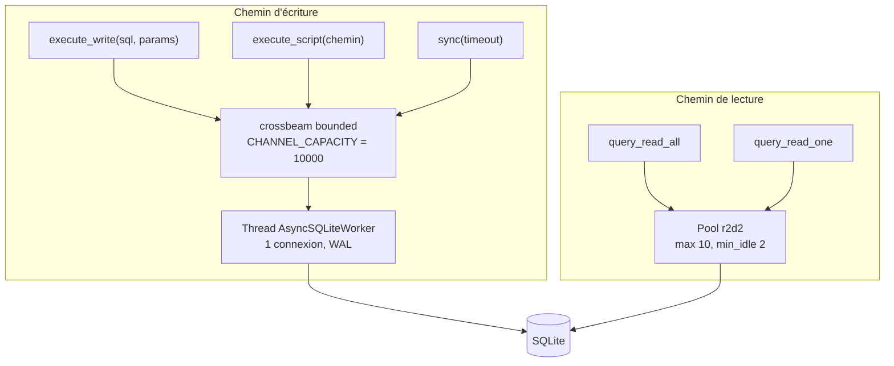

# Claude.md — Rust-SQLite-Async

## Préférences de travail

Réponses concises, sans verbiage. Code efficace avant tout.
Commentaires et documentation **en français, avec les accents**.
Les schémas se font en **Mermaid** — jamais de diagrammes ASCII.

## Ce qu'est ce dépôt

`AsyncSqlite` : sépare complètement les écritures des lectures SQLite.

- **Écritures** — sérialisées dans un thread worker unique, regroupées en une transaction
  `IMMEDIATE` par lot.
- **Lectures** — servies par un pool `r2d2` de 10 connexions, sans jamais bloquer le worker.

C'est le remède classique au « database is locked » : un seul écrivain, plusieurs lecteurs.

## Architecture



### Traitement d'un lot d'écritures

```mermaid
sequenceDiagram
    participant A as Appelant
    participant C as Canal
    participant W as Worker
    participant DB as SQLite

    A->>C: Execute / Sync
    W->>C: recv&lpar;&rpar; bloquant sur la 1re tâche
    W->>DB: BEGIN IMMEDIATE
    loop try_recv jusqu'à vider la file
        W->>DB: execute / execute_batch
    end
    W->>DB: COMMIT
    W-->>A: notification des Sync — après le commit
    Note over W,A: en cas d'erreur, ROLLBACK et aucune notification :<br/>les sync&lpar;&rpar; expirent, ce qui est le comportement voulu
```

## Invariants à ne pas casser

- **Les notifications `Sync` partent après le `COMMIT`**, jamais avant : c'est ce qui rend
  `sync()` utilisable comme barrière de durabilité.
- **En cas d'échec de transaction, on ne notifie pas** : les appels à `sync()` doivent expirer
  pour signaler la perte du lot.
- **`stop()` envoie `Sync` puis `Stop`**, dans cet ordre, et `Drop` appelle `stop()`.
- **Les lectures exigent que la base soit prête** (`is_ready`), sinon `get_read_conn` échoue.
- **`:memory:` est traduit en `file:memdb?mode=memory&cache=shared`** — un nom *fixe*. Deux
  instances `AsyncSqlite::new(":memory:")` dans le même processus partagent donc la même base.
  À garder en tête pour les tests parallèles.
- Le worker n'applique `journal_mode = WAL` et `busy_timeout` **que sur une base fichier** :
  le WAL n'a pas de sens en mémoire.

## Commandes

```bash
cargo build
cargo test
cargo clippy --all-targets
cargo fmt
```
